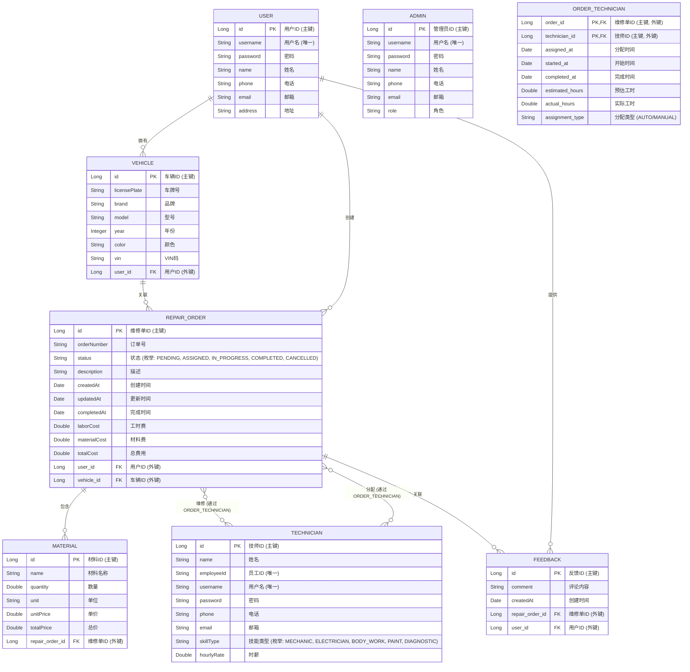

```mermaid
erDiagram
    USER {
        Long id PK "用户ID (主键)"
        String username "用户名 (唯一)"
        String password "密码"
        String name "姓名"
        String phone "电话"
        String email "邮箱"
        String address "地址"
    }

    VEHICLE {
        Long id PK "车辆ID (主键)"
        String licensePlate "车牌号"
        String brand "品牌"
        String model "型号"
        Integer year "年份"
        String color "颜色"
        String vin "VIN码"
        Long user_id FK "用户ID (外键)"
    }

    REPAIR_ORDER {
        Long id PK "维修单ID (主键)"
        String orderNumber "订单号"
        String status "状态 (枚举: PENDING, ASSIGNED, IN_PROGRESS, COMPLETED, CANCELLED)"
        String description "描述"
        Date createdAt "创建时间"
        Date updatedAt "更新时间"
        Date completedAt "完成时间"
        Double laborCost "工时费"
        Double materialCost "材料费"
        Double totalCost "总费用"
        Long user_id FK "用户ID (外键)"
        Long vehicle_id FK "车辆ID (外键)"
    }

    TECHNICIAN {
        Long id PK "技师ID (主键)"
        String name "姓名"
        String employeeId "员工ID (唯一)"
        String username "用户名 (唯一)"
        String password "密码"
        String phone "电话"
        String email "邮箱"
        String skillType "技能类型 (枚举: MECHANIC, ELECTRICIAN, BODY_WORK, PAINT, DIAGNOSTIC)"
        Double hourlyRate "时薪"
    }

    MATERIAL {
        Long id PK "材料ID (主键)"
        String name "材料名称"
        Double quantity "数量"
        String unit "单位"
        Double unitPrice "单价"
        Double totalPrice "总价"
        Long repair_order_id FK "维修单ID (外键)"
    }

    FEEDBACK {
        Long id PK "反馈ID (主键)"
        String comment "评论内容"
        Date createdAt "创建时间"
        Long repair_order_id FK "维修单ID (外键)"
        Long user_id FK "用户ID (外键)"
    }

    ADMIN {
        Long id PK "管理员ID (主键)"
        String username "用户名 (唯一)"
        String password "密码"
        String name "姓名"
        String phone "电话"
        String email "邮箱"
        String role "角色"
    }

    ORDER_TECHNICIAN {
        Long order_id PK, FK "维修单ID (主键, 外键)"
        Long technician_id PK, FK "技师ID (主键, 外键)"
        Date assigned_at "分配时间"
        Date started_at "开始时间"
        Date completed_at "完成时间"
        Double estimated_hours "预估工时"
        Double actual_hours "实际工时"
        String assignment_type "分配类型 (AUTO/MANUAL)"
    }

    USER ||--o{ VEHICLE : "拥有"
    USER ||--o{ REPAIR_ORDER : "创建"
    USER ||--o{ FEEDBACK : "提供"
    VEHICLE ||--o{ REPAIR_ORDER : "关联"
    REPAIR_ORDER ||--o{ MATERIAL : "包含"
    REPAIR_ORDER ||--o{ FEEDBACK : "关联"
    REPAIR_ORDER }o--o{ TECHNICIAN : "分配 (通过 ORDER_TECHNICIAN)"
    TECHNICIAN }o--o{ REPAIR_ORDER : "维修 (通过 ORDER_TECHNICIAN)"
```

- 说明:

PK: Primary Key (主键)

FK: Foreign Key (外键)

||--o{ 表示一对多关系 (箭头指向“多”的一方)

}o--o{ 表示多对多关系 (通过一个中间连接表实现)

