# 混合车辆故障诊断引擎（答辩展示用 Agent 架构）

> 说明：此架构仅用于答辩展示与方案说明，真实项目运行不依赖该模块；图中比例与阈值（如 90%/10%、T>=0.85）仅为示意。

```mermaid
flowchart LR
  Input[车辆数据输入\nText/Audio/VIN] --> A1

  subgraph Rule[规则预处理层]
    A1[正则表达式匹配]
    A2[逻辑决策树]
    A3[高频故障库]
    A1 --> A2 --> A3
  end

  A3 -->|毫秒级响应| B1
  A3 -->|90%基础场景直出（示意）| BasicOut[基础诊断输出]

  subgraph Multi[多智能体协同推理层]
    B1[多模态语义Agent\n非标准语音/对话分析]
    B2[库存关联Agent\n实时库存校验/优先级调整]
    B3[历史知识Agent\nRAG案例检索/车型特性]
    B1 --> B2 --> B3
  end

  A3 -->|10%上送（示意）| B1

  subgraph Privacy[动态隐私融合层（旁路监听）]
    P1[本地正则扫描\nVIN/车牌]
    P2[无损脱敏]
    P1 --> P2
  end

  B3 --> P1
  P2 --> D1

  subgraph Fusion[决策融合层]
    D1[迟融合策略]
    D2[加权证据推理]
    D3[冲突消解]
    D4[综合诊断报告]
    D1 --> D2 --> D3 --> D4
  end

  D4 --> S1

  subgraph Safety[智能安全网层]
    S1[全局置信度监测\nT>=0.85（示意）]
  end

  S1 -->|T>=0.85| Final[最终验证报告]
  S1 -->|T<0.85| Suspend[自动挂起]
  Suspend --> Human[人工复核流程]
```

## 架构要点
- **规则预处理层**：快速匹配高频故障，覆盖 90% 基础场景，提供毫秒级响应。
- **多智能体协同推理层**：在 10% 复杂场景中引入多模态、库存与历史知识协同推理。
- **动态隐私融合层**：本地正则扫描 VIN/车牌并进行无损脱敏后再进入融合决策。
- **决策融合层**：进行迟融合、证据加权与冲突消解，生成综合诊断报告。
- **智能安全网层**：置信度监测，高置信度自动出报告，低置信度进入人工复核。
